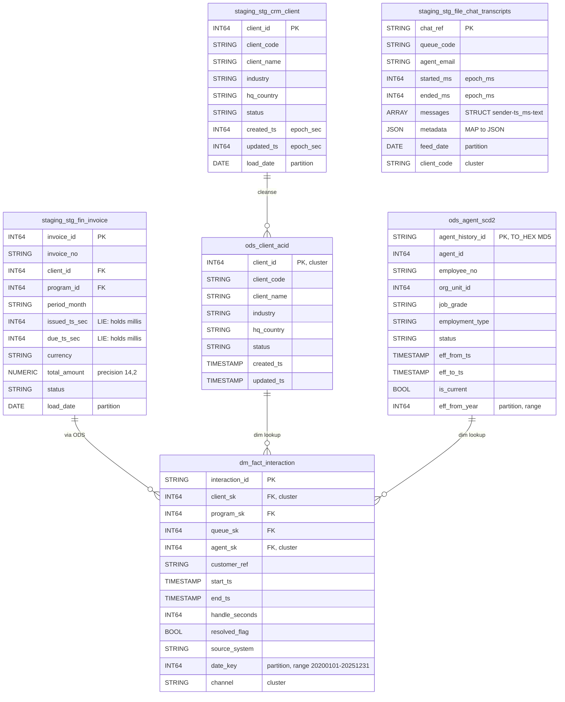

# Data Mapping

## Data Mapping: Hive → BigQuery Type & Structure Translation

### Overview
This is a 1:1 schema migration — all 100 Hive tables map to 100 BigQuery tables with the same names in 3 datasets. No tables are merged, split, or renamed. Column names are preserved exactly. The transformations are purely at the type/structure level.

### Dataset Mapping

| Hive Database | BigQuery Dataset | Tables | Views |
|---|---|---|---|
| `staging` | `staging` | 45 | 0 |
| `ods` | `ods` | 30 | 0 |
| `dm` | `dm` | 25 | 15 |

### Column Type Mapping (Complete)

| Hive Type | BigQuery Type | Columns Affected | Notes |
|---|---|---|---|
| `BIGINT` | `INT64` | ~85 columns | Direct 64-bit signed mapping |
| `INT` | `INT64` | ~45 columns | BigQuery has no INT32; widened to INT64 |
| `STRING` | `STRING` | ~120 columns | Direct |
| `BOOLEAN` | `BOOL` | ~25 columns | Direct |
| `DOUBLE` | `FLOAT64` | 3 columns | `sentiment_score`, `silence_pct` in speech_analytics |
| `TIMESTAMP` | `TIMESTAMP` | ~65 columns (ODS/DM only) | UTC-only |
| `DECIMAL(14,2)` | `NUMERIC` | 5 columns | `total_amount`, `line_amount`, `billed_amount`, `net_revenue`, `est_margin` |
| `DECIMAL(12,4)` | `NUMERIC` | 5 columns | `unit_rate`, `rate`, `old_rate`, `new_rate` |
| `DECIMAL(12,2)` | `NUMERIC` | 7 columns | `min_commit`, `amount`, `credit_amount`, `charge_amount`, `qty`, `sla_credit_amount`, `telco_cost_amount` |
| `DECIMAL(10,4)` | `NUMERIC` | 1 column | `target_value` |
| `DECIMAL(8,2)` | `NUMERIC` | 8 columns | `required_fte`, `avg_speed_answer_sec`, `avg_handle_sec`, `avg_handle_seconds` |
| `DECIMAL(7,2)` | `NUMERIC` | 1 column | `volume_variance_pct` |
| `DECIMAL(5,2)` | `NUMERIC` | 10 columns | `penalty_pct`, `overall_pct`, `adherence_pct`, `occupancy_pct`, `sl_pct`, `pct_promoters`, `pct_detractors` |
| `ARRAY<STRUCT<...>>` | `ARRAY<STRUCT<...>>` | 2 columns | `sections`, `messages` |
| `ARRAY<STRING>` | `ARRAY<STRING>` | 1 column | `keywords` |
| `MAP<STRING,STRING>` | `JSON` | 1 column | `metadata` |

### Partition Column Type Changes

Partition columns that were `STRING` in Hive must become `DATE`, `TIMESTAMP`, `DATETIME`, or `INT64` in BigQuery (BigQuery partition constraint). The following partition columns change type:

| Table(s) | Hive Partition Col | Hive Type | BQ Type | Rationale |
|---|---|---|---|---|
| 27 sqoop mirrors | `load_date` | `STRING` | `DATE` | Follows existing `stg_crm_contract.sql` pattern |
| 8 delta feeds | `extract_ts` | `STRING` | `DATE` (renamed to `extract_date`) | Partition requires DATE type |
| 10 file feeds | `feed_date` | `STRING` | `DATE` | Partition column; `client_code` demoted to regular column + cluster key |
| 15 ODS cleanse | `snapshot_date` / `event_date` / `call_date` / `sched_date` | `STRING` | `DATE` | Partition requires DATE type |
| 8 ODS delta-merge | `work_month` / `period_month` / `swap_month` / `event_month` | `STRING` ('YYYY-MM') | `DATE` | First-of-month DATE (e.g., '2024-01' → DATE '2024-01-01') |
| 3 ODS SCD-2 | `eff_from_year` | `INT` | `INT64` | Already INT — direct mapping for RANGE_BUCKET |
| DM facts (9) | `date_key` | `INT` | `INT64` | Already INT — RANGE_BUCKET(20200101, 20251231, 1) |
| `fact_interaction` | `channel` | `STRING` (2nd partition) | Demoted to regular column | Becomes `CLUSTER BY channel` |
| DM aggs (3) | `period_month` | `STRING` | `DATE` | Same first-of-month pattern |
| `agg_agent_weekly` | `week_start_key` | `INT` | `INT64` | RANGE_BUCKET same as date_key |

### Multi-Column Partition → Single Partition + Clustering

| Table | Hive Partitions | BigQuery Partition | BigQuery Clustering |
|---|---|---|---|
| `stg_wfm_schedule` | `load_date, site_code` | `PARTITION BY load_date` (DATE) | `CLUSTER BY site_code` |
| All 10 file feeds | `client_code, feed_date` | `PARTITION BY feed_date` (DATE) | `CLUSTER BY client_code` |
| `fact_interaction` | `date_key, channel` | `PARTITION BY RANGE_BUCKET(date_key, ...)` | `CLUSTER BY channel, agent_sk, client_sk` |

### Bucketing → Clustering

| Table | Hive CLUSTERED BY | BigQuery CLUSTER BY |
|---|---|---|
| `stg_tel_call` | `call_id INTO 16 BUCKETS` | `CLUSTER BY call_id` |
| `ods_client_acid` | `client_id INTO 4 BUCKETS` | `CLUSTER BY client_id` |
| `ods_agent_acid` | `agent_id INTO 8 BUCKETS` | `CLUSTER BY agent_id` |
| `ods_ticket_acid` | `ticket_id INTO 8 BUCKETS` | `CLUSTER BY ticket_id` |
| `ods_invoice_acid` | `invoice_id INTO 4 BUCKETS` | `CLUSTER BY invoice_id` |
| `fact_interaction` | `agent_sk INTO 16 BUCKETS` | Included in CLUSTER BY (see above) |

### Complex-Type Column Details

**`stg_file_qa_forms.sections`** (ARRAY of STRUCT):
```
Hive:     ARRAY<STRUCT<section_code:STRING,max_points:INT,scored_points:INT>>
BigQuery: ARRAY<STRUCT<section_code STRING, max_points INT64, scored_points INT64>>
```
Queryable via `UNNEST(sections)` in BigQuery. Sub-field `INT` → `INT64`.

**`stg_file_chat_transcripts.messages`** (ARRAY of STRUCT):
```
Hive:     ARRAY<STRUCT<sender:STRING,ts_ms:BIGINT,text:STRING>>
BigQuery: ARRAY<STRUCT<sender STRING, ts_ms INT64, text STRING>>
```

**`stg_file_chat_transcripts.metadata`** (MAP):
```
Hive:     MAP<STRING,STRING>
BigQuery: JSON
```
Queryable via `JSON_VALUE(metadata, '$.key_name')`. Column description: `'Hive MAP<STRING,STRING> represented as JSON. Query individual keys with JSON_VALUE(metadata, "$.key_name").'`

**`stg_file_speech_analytics.keywords`** (ARRAY of STRING):
```
Hive:     ARRAY<STRING>
BigQuery: ARRAY<STRING>
```
Queryable via `UNNEST(keywords)`.

### ACID Table Transformation (4 tables)

| Table | Hive Properties Dropped | BigQuery Equivalent |
|---|---|---|
| `ods_client_acid` | `STORED AS ORC`, `transactional=true`, `CLUSTERED BY (client_id) INTO 4 BUCKETS` | Native table, `CLUSTER BY client_id` |
| `ods_agent_acid` | Same pattern | Native table, `CLUSTER BY agent_id` |
| `ods_ticket_acid` | Same pattern | Native table, `CLUSTER BY ticket_id` |
| `ods_invoice_acid` | Same pattern | Native table, `CLUSTER BY invoice_id` |

All columns remain nullable (no `NOT NULL`) to support `MERGE INTO ... WHEN MATCHED THEN UPDATE` without blocking on required fields.

### SCD-2 Surrogate Keys (3 tables)

| Table | Surrogate Key Column | Type | Description |
|---|---|---|---|
| `ods_agent_scd2` | `agent_history_id` | `STRING` | `TO_HEX(MD5(CONCAT(CAST(agent_id AS STRING), '\|', CAST(eff_from_ts AS STRING))))` |
| `ods_agent_skill_scd2` | `agent_skill_history_id` | `STRING` | `TO_HEX(MD5(CONCAT(CAST(agent_id AS STRING), '\|', CAST(skill_id AS STRING), '\|', CAST(eff_from_ts AS STRING))))` |
| `ods_agent_assignment_scd2` | `assignment_history_id` | `STRING` | `TO_HEX(MD5(CONCAT(CAST(agent_id AS STRING), '\|', CAST(program_id AS STRING), '\|', CAST(eff_from_ts AS STRING))))` |

### Epoch Column Inventory by Encoding

**Epoch SECONDS (staging INT64 → ODS TIMESTAMP via `TIMESTAMP_SECONDS`):**
- CRM: `created_ts`, `updated_ts`, `go_live_ts`, `effective_ts` across 6 tables
- HR: `hire_ts`, `term_ts`, `event_ts`, `created_ts`, `effective_ts`, `expiry_ts` across 5 tables
- WFM: `created_epoch`, `start_epoch`, `end_epoch`, `request_epoch`, `interval_start_epoch` across 5 tables
- Telephony: `start_epoch`, `answer_epoch`, `end_epoch`, `created_epoch` across 5 tables
- Finance: `effective_ts`, `expiry_ts` on `stg_fin_rate_card`

**Epoch MILLISECONDS (staging INT64 → ODS TIMESTAMP via `TIMESTAMP_MILLIS`):**
- Ticketing: `created_ms`, `updated_ms`, `event_ms` across 3 tables
- All delta feeds: `change_ms` on all 8 delta tables
- All file feeds: `*_ms` columns on all 10 file-feed tables
- Finance: `created_ms` on `stg_fin_invoice_line`

**Oracle string YYYYMMDDHH24MISS (staging STRING → ODS TIMESTAMP via `PARSE_TIMESTAMP`):**
- `stg_crm_contract`: `start_dt`, `end_dt`, `signed_dt`
- `stg_crm_contract_line`: `effective_dt`

**LIE columns (staging INT64 named `*_sec` but holding MILLIS → ODS TIMESTAMP via `TIMESTAMP_MILLIS`):**
- `stg_fin_invoice.issued_ts_sec`
- `stg_fin_invoice.due_ts_sec`


