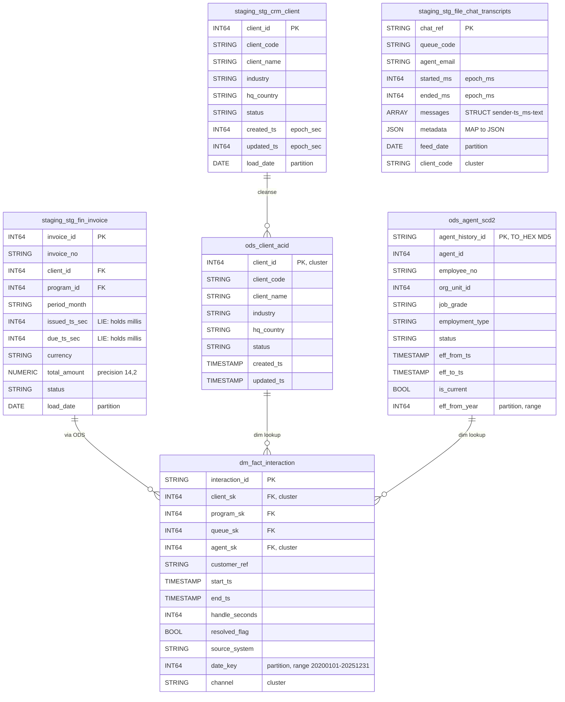

# Locked Decisions for Story 189e0058-cfb0-4157-845c-09d94b4b9c27

## Implementation Approach
## Implementation Approach: BigQuery DDL Generation for 100 Tables + 15 Views

### Overall Strategy
Generate BigQuery `CREATE TABLE` / `CREATE VIEW` DDL by systematically translating each Hive source DDL file (02–09 `.hql`) using the `manifests/tables.yaml` as the canonical schema reference. Output is organized into three dataset subdirectories (`bigquery/ddl/staging/`, `bigquery/ddl/ods/`, `bigquery/ddl/dm/`), one `.sql` file per table/view.

### Existing Pattern (Follow Exactly)
The existing `bigquery/ddl/staging/stg_crm_contract.sql` establishes the canonical DDL pattern:
- **Header comment block**: documents the source Hive DDL, conversion notes, and column count reconciliation
- **`CREATE TABLE IF NOT EXISTS dataset.table_name`** (not `CREATE OR REPLACE`)
- **Hive-specific clauses dropped**: `EXTERNAL`, `STORED AS`, `LOCATION`, `TBLPROPERTIES`, `ROW FORMAT`, `SERDE`, `CLUSTERED BY`
- **Partition columns inlined** into the column list (not separate)
- **Partition type adjustment**: Hive `STRING` partition columns become `DATE` where the downstream consumers treat them as dates (e.g., `load_date`, `snapshot_date`, `event_date`, `call_date`, `sched_date`)
- **Column descriptions** via `OPTIONS(description = '...')` for legacy trap documentation
- **No `NOT NULL` constraints** on any column (MERGE-target compatibility per AC #4)

### DDL Organization — 118 Files Total

| Directory | Count | Contents |
|---|---|---|
| `bigquery/ddl/staging/` | 45 files | Sqoop mirrors (27), delta feeds (8), file feeds (10) |
| `bigquery/ddl/ods/` | 30 files | Cleansed (15), delta-merged (8), SCD-2 (3), ACID (4) |
| `bigquery/ddl/dm/` | 40 files | Dimensions (9), facts (9), aggregates (7), views (15) |
| **Total** | **115** | 100 tables + 15 views |

Plus 3 orchestration files:
- `bigquery/ddl/00-create-datasets.sql` — `CREATE SCHEMA IF NOT EXISTS staging/ods/dm`
- `bigquery/ddl/run-all-ddl.sh` — shell script executing all DDL files via `bq query --nouse_legacy_sql` in dependency order
- `bigquery/ddl/README.md` — documents conventions, type mapping, and partitioning decisions

### Type Mapping Rules

| Hive Type | BigQuery Type | Notes |
|---|---|---|
| `BIGINT` | `INT64` | |
| `INT` | `INT64` | BigQuery has no INT32 |
| `SMALLINT` | `INT64` | |
| `STRING` | `STRING` | |
| `BOOLEAN` | `BOOL` | |
| `DOUBLE` | `FLOAT64` | |
| `TIMESTAMP` | `TIMESTAMP` | UTC-only |
| `DATE` | `DATE` | |
| `DECIMAL(p,s)` | `NUMERIC(p,s)` | All 12 precision/scale pairs fit within NUMERIC(38,9) |
| `ARRAY<STRUCT<...>>` | `ARRAY<STRUCT<...>>` | Native BigQuery support |
| `ARRAY<STRING>` | `ARRAY<STRING>` | REPEATED STRING |
| `MAP<STRING,STRING>` | `JSON` | Per user decision — for `stg_file_chat_transcripts.metadata` |

### Partitioning Translation

| Layer | Hive Partition Type | BigQuery Partition | Example |
|---|---|---|---|
| Staging (sqoop mirrors) | `load_date STRING` | `PARTITION BY load_date` (type changed to `DATE`) | `stg_crm_client` |
| Staging (deltas) | `extract_ts STRING` | `PARTITION BY extract_date` (derived `DATE` column replacing STRING) | `stg_fin_timesheet_delta` |
| Staging (file feeds) | `client_code STRING, feed_date STRING` | `PARTITION BY feed_date` (DATE), `client_code` becomes a regular column + clustering column | Multi-column partition → single partition + cluster |
| ODS (cleanse) | `snapshot_date/event_date/call_date/sched_date STRING` | `PARTITION BY <col>` (type changed to `DATE`) | `ods_program` |
| ODS (delta-merge) | `work_month/period_month/swap_month/event_month STRING` | `PARTITION BY <col>` (keep as `STRING`, use pseudo-column partition or leave unpartitioned if too few distinct values) | `ods_timesheet` |
| ODS (SCD-2) | `eff_from_year INT` | `PARTITION BY RANGE_BUCKET(eff_from_year, GENERATE_ARRAY(2020, 2026, 1))` | `ods_agent_scd2` |
| ODS (ACID) | none | Unpartitioned (small tables, MERGE targets) | `ods_client_acid` |
| DM (dimensions) | none | Unpartitioned (small) | `dim_agent` |
| DM (facts) | `date_key INT` | `PARTITION BY RANGE_BUCKET(date_key, GENERATE_ARRAY(20200101, 20251231, 1))` | `fact_interaction` |
| DM (facts) | `date_key INT, channel STRING` | `PARTITION BY RANGE_BUCKET(date_key, ...)` + `CLUSTER BY channel` (multi-col partition → single + cluster) | `fact_interaction` |
| DM (facts) | `period_month STRING` | `PARTITION BY period_month` — keep as STRING pseudo-partition or unpartitioned | `fact_billing_line` |
| DM (aggs) | `date_key INT` | Same as facts | `agg_agent_daily` |
| DM (aggs) | `period_month STRING` | Same as facts | `agg_program_monthly` |
| DM (aggs) | `week_start_key INT` | `PARTITION BY RANGE_BUCKET(week_start_key, GENERATE_ARRAY(20200101, 20251231, 1))` | `agg_agent_weekly` |

### Clustering Strategy
- `fact_interaction`: `CLUSTER BY channel, agent_sk, client_sk` (channel demoted from 2nd partition)
- `fact_billing_line`: `CLUSTER BY client_sk, program_sk`
- Staging file feeds: `CLUSTER BY client_code` (demoted from partition)
- `stg_tel_call`: `CLUSTER BY call_id` (replaces CLUSTERED BY bucketing)
- ACID tables: `CLUSTER BY <pk>` (replaces CLUSTERED BY bucketing)

### Special Handling Per Acceptance Criteria

1. **Epoch columns in staging (AC #2)**: Remain `INT64`. Column descriptions document the encoding: `'epoch SECONDS (legacy)'`, `'epoch MILLISECONDS (legacy)'`, or `'Oracle string YYYYMMDDHH24MISS (legacy)'`. The 2 lie_ms columns (`issued_ts_sec`, `due_ts_sec`) carry: `'WARNING: column name says seconds but VALUES ARE MILLISECONDS. All consumers divide by 1000. See EPOCH-POLICY.md.'`

2. **Epoch columns in ODS/DM (AC #2)**: All epoch-derived columns are `TIMESTAMP` (not INT64/STRING). The conversion happens in the cleanse SQL scripts, not in the DDL.

3. **Complex types (AC #3)**:
   - `stg_file_qa_forms.sections` → `ARRAY<STRUCT<section_code STRING, max_points INT64, scored_points INT64>>`
   - `stg_file_chat_transcripts.messages` → `ARRAY<STRUCT<sender STRING, ts_ms INT64, text STRING>>`
   - `stg_file_chat_transcripts.metadata` → `JSON` (with description: `'MAP<STRING,STRING> from Hive — represented as JSON in BigQuery'`)
   - `stg_file_speech_analytics.keywords` → `ARRAY<STRING>`

4. **ACID tables (AC #4)**: Created as native (non-external) BigQuery tables. No ORC/transactional properties. No `NOT NULL` constraints (MERGE-compatible). Clustering by PK replaces CLUSTERED BY bucketing.

5. **SCD-2 surrogate keys (AC #5)**: Columns typed as `STRING` with description: `'Surrogate key: TO_HEX(MD5(CONCAT(CAST(<business_key> AS STRING), ''|'', CAST(eff_from_ts AS STRING))))'`

6. **Format-specific tables (AC #6)**: All created as native BigQuery tables. Table-level `OPTIONS(description = ...)` documents the original format:
   - RegexSerDe tables: `'Source: Hive RegexSerDe — pre-processed to structured format before BQ load'`
   - SequenceFile/RCFile: `'Source: Hive SequenceFile/RCFile — converted to Parquet/JSON for BQ load'`
   - JsonSerDe tables: `'Source: Hive JsonSerDe — loaded as NEWLINE_DELIMITED_JSON'`
   - TextFile pipe-delimited: `'Source: Hive TEXTFILE pipe-delimited — loaded as CSV with pipe delimiter'`

7. **DECIMAL precision (AC #7)**: All 12 source precision/scale pairs map to `NUMERIC(p,s)`. None exceed NUMERIC(38,9). No widening.

### Views (15)
All 15 views are `CREATE VIEW IF NOT EXISTS dm.<view_name> AS ...` with SQL translated per the locked SQL Dialect Translation Strategy:
- `NDV()` → `APPROX_COUNT_DISTINCT()`
- `GROUPING__ID` → `GROUPING()` with bit-order remapping
- `RLIKE` → `REGEXP_CONTAINS()`
- `regexp_extract()` → `REGEXP_EXTRACT()`
- `unix_timestamp(ts)` → `UNIX_SECONDS(ts)`
- `from_unixtime()` → `TIMESTAMP_SECONDS()`
- `date_add(ts, 7)` → `TIMESTAMP_ADD(ts, INTERVAL 7 DAY)`
- Recursive CTE (`vw_org_hierarchy`) → supported natively in BigQuery

### Execution Order
The `run-all-ddl.sh` script executes in this order:
1. `00-create-datasets.sql` (create 3 datasets)
2. All staging tables (no dependencies)
3. All ODS tables (no dependencies on other DDL — dependencies are runtime)
4. All DM tables (no dependencies on other DDL)
5. All DM views (depend on tables existing in all 3 datasets)

## Data Mapping
## Data Mapping: Hive → BigQuery Type & Structure Translation

### Overview
This is a 1:1 schema migration — all 100 Hive tables map to 100 BigQuery tables with the same names in 3 datasets. No tables are merged, split, or renamed. Column names are preserved exactly. The transformations are purely at the type/structure level.

### Dataset Mapping

| Hive Database | BigQuery Dataset | Tables | Views |
|---|---|---|---|
| `staging` | `staging` | 45 | 0 |
| `ods` | `ods` | 30 | 0 |
| `dm` | `dm` | 25 | 15 |

### Column Type Mapping (Complete)

| Hive Type | BigQuery Type | Columns Affected | Notes |
|---|---|---|---|
| `BIGINT` | `INT64` | ~85 columns | Direct 64-bit signed mapping |
| `INT` | `INT64` | ~45 columns | BigQuery has no INT32; widened to INT64 |
| `STRING` | `STRING` | ~120 columns | Direct |
| `BOOLEAN` | `BOOL` | ~25 columns | Direct |
| `DOUBLE` | `FLOAT64` | 3 columns | `sentiment_score`, `silence_pct` in speech_analytics |
| `TIMESTAMP` | `TIMESTAMP` | ~65 columns (ODS/DM only) | UTC-only |
| `DECIMAL(14,2)` | `NUMERIC` | 5 columns | `total_amount`, `line_amount`, `billed_amount`, `net_revenue`, `est_margin` |
| `DECIMAL(12,4)` | `NUMERIC` | 5 columns | `unit_rate`, `rate`, `old_rate`, `new_rate` |
| `DECIMAL(12,2)` | `NUMERIC` | 7 columns | `min_commit`, `amount`, `credit_amount`, `charge_amount`, `qty`, `sla_credit_amount`, `telco_cost_amount` |
| `DECIMAL(10,4)` | `NUMERIC` | 1 column | `target_value` |
| `DECIMAL(8,2)` | `NUMERIC` | 8 columns | `required_fte`, `avg_speed_answer_sec`, `avg_handle_sec`, `avg_handle_seconds` |
| `DECIMAL(7,2)` | `NUMERIC` | 1 column | `volume_variance_pct` |
| `DECIMAL(5,2)` | `NUMERIC` | 10 columns | `penalty_pct`, `overall_pct`, `adherence_pct`, `occupancy_pct`, `sl_pct`, `pct_promoters`, `pct_detractors` |
| `ARRAY<STRUCT<...>>` | `ARRAY<STRUCT<...>>` | 2 columns | `sections`, `messages` |
| `ARRAY<STRING>` | `ARRAY<STRING>` | 1 column | `keywords` |
| `MAP<STRING,STRING>` | `JSON` | 1 column | `metadata` |

### Partition Column Type Changes

Partition columns that were `STRING` in Hive must become `DATE`, `TIMESTAMP`, `DATETIME`, or `INT64` in BigQuery (BigQuery partition constraint). The following partition columns change type:

| Table(s) | Hive Partition Col | Hive Type | BQ Type | Rationale |
|---|---|---|---|---|
| 27 sqoop mirrors | `load_date` | `STRING` | `DATE` | Follows existing `stg_crm_contract.sql` pattern |
| 8 delta feeds | `extract_ts` | `STRING` | `DATE` (renamed to `extract_date`) | Partition requires DATE type |
| 10 file feeds | `feed_date` | `STRING` | `DATE` | Partition column; `client_code` demoted to regular column + cluster key |
| 15 ODS cleanse | `snapshot_date` / `event_date` / `call_date` / `sched_date` | `STRING` | `DATE` | Partition requires DATE type |
| 8 ODS delta-merge | `work_month` / `period_month` / `swap_month` / `event_month` | `STRING` ('YYYY-MM') | `DATE` | First-of-month DATE (e.g., '2024-01' → DATE '2024-01-01') |
| 3 ODS SCD-2 | `eff_from_year` | `INT` | `INT64` | Already INT — direct mapping for RANGE_BUCKET |
| DM facts (9) | `date_key` | `INT` | `INT64` | Already INT — RANGE_BUCKET(20200101, 20251231, 1) |
| `fact_interaction` | `channel` | `STRING` (2nd partition) | Demoted to regular column | Becomes `CLUSTER BY channel` |
| DM aggs (3) | `period_month` | `STRING` | `DATE` | Same first-of-month pattern |
| `agg_agent_weekly` | `week_start_key` | `INT` | `INT64` | RANGE_BUCKET same as date_key |

### Multi-Column Partition → Single Partition + Clustering

| Table | Hive Partitions | BigQuery Partition | BigQuery Clustering |
|---|---|---|---|
| `stg_wfm_schedule` | `load_date, site_code` | `PARTITION BY load_date` (DATE) | `CLUSTER BY site_code` |
| All 10 file feeds | `client_code, feed_date` | `PARTITION BY feed_date` (DATE) | `CLUSTER BY client_code` |
| `fact_interaction` | `date_key, channel` | `PARTITION BY RANGE_BUCKET(date_key, ...)` | `CLUSTER BY channel, agent_sk, client_sk` |

### Bucketing → Clustering

| Table | Hive CLUSTERED BY | BigQuery CLUSTER BY |
|---|---|---|
| `stg_tel_call` | `call_id INTO 16 BUCKETS` | `CLUSTER BY call_id` |
| `ods_client_acid` | `client_id INTO 4 BUCKETS` | `CLUSTER BY client_id` |
| `ods_agent_acid` | `agent_id INTO 8 BUCKETS` | `CLUSTER BY agent_id` |
| `ods_ticket_acid` | `ticket_id INTO 8 BUCKETS` | `CLUSTER BY ticket_id` |
| `ods_invoice_acid` | `invoice_id INTO 4 BUCKETS` | `CLUSTER BY invoice_id` |
| `fact_interaction` | `agent_sk INTO 16 BUCKETS` | Included in CLUSTER BY (see above) |

### Complex-Type Column Details

**`stg_file_qa_forms.sections`** (ARRAY of STRUCT):
```
Hive:     ARRAY<STRUCT<section_code:STRING,max_points:INT,scored_points:INT>>
BigQuery: ARRAY<STRUCT<section_code STRING, max_points INT64, scored_points INT64>>
```
Queryable via `UNNEST(sections)` in BigQuery. Sub-field `INT` → `INT64`.

**`stg_file_chat_transcripts.messages`** (ARRAY of STRUCT):
```
Hive:     ARRAY<STRUCT<sender:STRING,ts_ms:BIGINT,text:STRING>>
BigQuery: ARRAY<STRUCT<sender STRING, ts_ms INT64, text STRING>>
```

**`stg_file_chat_transcripts.metadata`** (MAP):
```
Hive:     MAP<STRING,STRING>
BigQuery: JSON
```
Queryable via `JSON_VALUE(metadata, '$.key_name')`. Column description: `'Hive MAP<STRING,STRING> represented as JSON. Query individual keys with JSON_VALUE(metadata, "$.key_name").'`

**`stg_file_speech_analytics.keywords`** (ARRAY of STRING):
```
Hive:     ARRAY<STRING>
BigQuery: ARRAY<STRING>
```
Queryable via `UNNEST(keywords)`.

### ACID Table Transformation (4 tables)

| Table | Hive Properties Dropped | BigQuery Equivalent |
|---|---|---|
| `ods_client_acid` | `STORED AS ORC`, `transactional=true`, `CLUSTERED BY (client_id) INTO 4 BUCKETS` | Native table, `CLUSTER BY client_id` |
| `ods_agent_acid` | Same pattern | Native table, `CLUSTER BY agent_id` |
| `ods_ticket_acid` | Same pattern | Native table, `CLUSTER BY ticket_id` |
| `ods_invoice_acid` | Same pattern | Native table, `CLUSTER BY invoice_id` |

All columns remain nullable (no `NOT NULL`) to support `MERGE INTO ... WHEN MATCHED THEN UPDATE` without blocking on required fields.

### SCD-2 Surrogate Keys (3 tables)

| Table | Surrogate Key Column | Type | Description |
|---|---|---|---|
| `ods_agent_scd2` | `agent_history_id` | `STRING` | `TO_HEX(MD5(CONCAT(CAST(agent_id AS STRING), '\|', CAST(eff_from_ts AS STRING))))` |
| `ods_agent_skill_scd2` | `agent_skill_history_id` | `STRING` | `TO_HEX(MD5(CONCAT(CAST(agent_id AS STRING), '\|', CAST(skill_id AS STRING), '\|', CAST(eff_from_ts AS STRING))))` |
| `ods_agent_assignment_scd2` | `assignment_history_id` | `STRING` | `TO_HEX(MD5(CONCAT(CAST(agent_id AS STRING), '\|', CAST(program_id AS STRING), '\|', CAST(eff_from_ts AS STRING))))` |

### Epoch Column Inventory by Encoding

**Epoch SECONDS (staging INT64 → ODS TIMESTAMP via `TIMESTAMP_SECONDS`):**
- CRM: `created_ts`, `updated_ts`, `go_live_ts`, `effective_ts` across 6 tables
- HR: `hire_ts`, `term_ts`, `event_ts`, `created_ts`, `effective_ts`, `expiry_ts` across 5 tables
- WFM: `created_epoch`, `start_epoch`, `end_epoch`, `request_epoch`, `interval_start_epoch` across 5 tables
- Telephony: `start_epoch`, `answer_epoch`, `end_epoch`, `created_epoch` across 5 tables
- Finance: `effective_ts`, `expiry_ts` on `stg_fin_rate_card`

**Epoch MILLISECONDS (staging INT64 → ODS TIMESTAMP via `TIMESTAMP_MILLIS`):**
- Ticketing: `created_ms`, `updated_ms`, `event_ms` across 3 tables
- All delta feeds: `change_ms` on all 8 delta tables
- All file feeds: `*_ms` columns on all 10 file-feed tables
- Finance: `created_ms` on `stg_fin_invoice_line`

**Oracle string YYYYMMDDHH24MISS (staging STRING → ODS TIMESTAMP via `PARSE_TIMESTAMP`):**
- `stg_crm_contract`: `start_dt`, `end_dt`, `signed_dt`
- `stg_crm_contract_line`: `effective_dt`

**LIE columns (staging INT64 named `*_sec` but holding MILLIS → ODS TIMESTAMP via `TIMESTAMP_MILLIS`):**
- `stg_fin_invoice.issued_ts_sec`
- `stg_fin_invoice.due_ts_sec`



## Validation
## Validation: DDL Correctness & Acceptance Criteria Coverage

### 1. Syntactic Validation — Zero-Error DDL Application (AC #1)
Every generated `.sql` file must be executable via `bq query --nouse_legacy_sql` against a scratch dataset with zero errors. Validation approach:

- **Automated dry-run script** (`validation/validate_ddl.sh`): Iterates all 115 DDL files, runs each against a temporary BigQuery dataset (`_ddl_validation_scratch`), captures exit codes and error messages, then drops the dataset.
- **Column count reconciliation**: After applying all DDL, query `INFORMATION_SCHEMA.COLUMNS` for each table and compare column counts against the source counts in `manifests/tables.yaml`. The expected count = data columns + inlined partition columns. Generate a report: `validation/column_count_report.csv`.
- **Pass criteria**: 100 tables created, 15 views created, 0 errors, all column counts match.

### 2. Epoch Encoding Validation (AC #2)
Verify that the DDL correctly types epoch columns per the EPOCH-POLICY.md matrix:

- **Staging layer check**: Query `INFORMATION_SCHEMA.COLUMNS` for all columns tagged `epoch_sec`, `epoch_ms`, `ora_str`, or `lie_ms` in `tables.yaml`. Assert all are `INT64` (not TIMESTAMP) in staging.
- **ODS/DM layer check**: Assert all epoch-derived columns are `TIMESTAMP` (not INT64 or STRING).
- **Lie column description check**: Assert `stg_fin_invoice.issued_ts_sec` and `stg_fin_invoice.due_ts_sec` have column descriptions containing the word "milliseconds" or "MILLIS" — proving the trap is documented.
- **Validation SQL**: `validation/check_epoch_types.sql` — a single BigQuery script that runs all 4 assertions and outputs PASS/FAIL per check.

### 3. Complex Type Validation (AC #3)
Verify ARRAY, STRUCT, and JSON columns via `INFORMATION_SCHEMA.COLUMN_FIELD_PATHS`:

- `stg_file_qa_forms.sections`: Assert `data_type` = `ARRAY<STRUCT<section_code STRING, max_points INT64, scored_points INT64>>` with 3 sub-fields in COLUMN_FIELD_PATHS.
- `stg_file_chat_transcripts.messages`: Assert `data_type` = `ARRAY<STRUCT<sender STRING, ts_ms INT64, text STRING>>` with 3 sub-fields.
- `stg_file_chat_transcripts.metadata`: Assert `data_type` = `JSON`.
- `stg_file_speech_analytics.keywords`: Assert `data_type` = `ARRAY<STRING>` (REPEATED STRING).
- **Validation SQL**: `validation/check_complex_types.sql`

### 4. ACID Table Validation (AC #4)
For the 4 ACID tables (`ods_client_acid`, `ods_agent_acid`, `ods_ticket_acid`, `ods_invoice_acid`):

- Assert each exists in `INFORMATION_SCHEMA.TABLES` as type `BASE TABLE` (not `EXTERNAL`).
- Assert no column has `is_nullable = 'NO'` (all nullable → MERGE-compatible).
- Assert no table description contains 'ORC' or 'transactional'.
- **Validation SQL**: `validation/check_acid_tables.sql`

### 5. SCD-2 Surrogate Key Validation (AC #5)
For the 3 SCD-2 tables:

- Assert `agent_history_id`, `agent_skill_history_id`, `assignment_history_id` are `STRING` type.
- Assert each column's description contains `TO_HEX(MD5(` — proving the generation method is documented.
- **Validation SQL**: `validation/check_scd2_keys.sql`

### 6. Format Provenance Validation (AC #6)
For the 14 format-specific staging tables (8 pipe-delimited TEXTFILE, 3 RegexSerDe/SequenceFile/RCFile, 3 JsonSerDe):

- Assert all are `BASE TABLE` in `INFORMATION_SCHEMA.TABLES` (not external).
- Assert no table description contains 'SerDe', 'TEXTFILE', 'SEQUENCEFILE', or 'RCFILE' as a property — only as historical documentation.
- Assert table descriptions DO contain provenance text (e.g., 'Source: Hive RegexSerDe').
- **Validation SQL**: `validation/check_format_tables.sql`

### 7. DECIMAL Precision Validation (AC #7)
For all DECIMAL columns across all layers:

- Query `INFORMATION_SCHEMA.COLUMNS` where `data_type LIKE 'NUMERIC%'`.
- Assert each maps to `NUMERIC` (not `BIGNUMERIC`) since all 12 source precision/scale pairs (including the largest at DECIMAL(14,2)) fit within NUMERIC(38,9).
- Assert no column is widened beyond the source precision.
- Cross-reference the 12 distinct precision/scale pairs: `DECIMAL(14,2)`, `DECIMAL(12,4)`, `DECIMAL(12,2)`, `DECIMAL(10,4)`, `DECIMAL(8,2)`, `DECIMAL(7,2)`, `DECIMAL(5,2)`.
- **Validation SQL**: `validation/check_decimal_precision.sql`

### 8. Cross-Cutting Validation
- **Manifest completeness**: A Python script (`validation/check_manifest_coverage.py`) parses `manifests/tables.yaml` and asserts every table/view has a corresponding `.sql` file in `bigquery/ddl/`.
- **View dependency order**: Assert all tables referenced by each view exist before the view is created. The `run-all-ddl.sh` script must execute views last.
- **Naming convention**: Assert all table/view names in BigQuery match the source names exactly (case-sensitive comparison against `tables.yaml`).

### Edge Cases & Error Handling
- **NULL partition values**: BigQuery handles NULL in DATE partitions as `__NULL__` partition — no special DDL needed.
- **Empty ARRAY/STRUCT**: BigQuery allows empty arrays natively — no default value needed.
- **JSON column with no schema enforcement**: The `metadata` JSON column accepts any valid JSON — this is intentional (MAP semantics).
- **NUMERIC precision**: If a future column exceeds NUMERIC(38,9), the validation will flag it for BIGNUMERIC upgrade — but none currently do.
