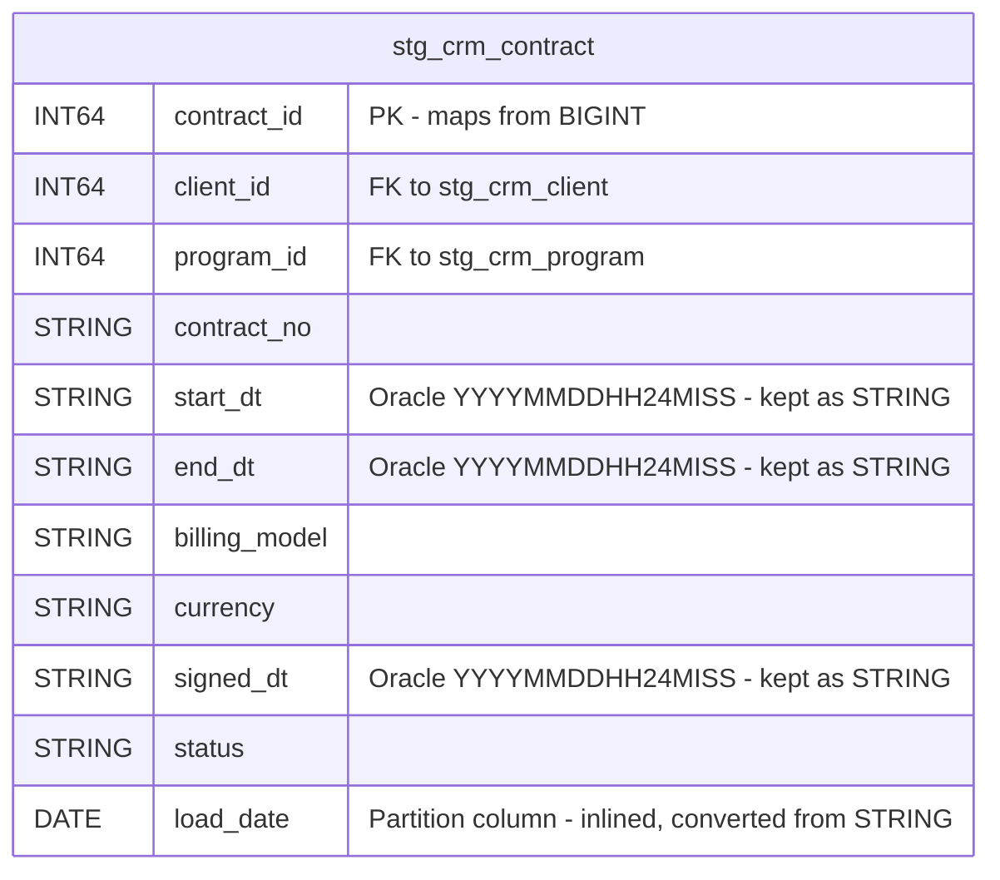

# Locked Decisions for Story bdbee598-8339-4b0b-84bb-8be1ca88d5a7

## Implementation Approach
## Implementation Approach: `staging.stg_crm_contract` DDL Conversion

### What Gets Built
A single BigQuery DDL file (`bigquery/ddl/staging/stg_crm_contract.sql`) containing a `CREATE TABLE` statement for `staging.stg_crm_contract`, plus a Node.js validation script that:
1. Applies the DDL to a scratch BigQuery dataset
2. Reads back the landed schema via `table.getMetadata()`
3. Seeds edge-case rows into both a scratch Impala source table and the BigQuery target
4. Asserts column-for-column type fidelity and data round-trip correctness

### Key Technical Choices

1. **Managed table, no Hive storage clauses**: The BigQuery DDL is a plain `CREATE TABLE` — no `EXTERNAL`, `STORED AS PARQUET`, `LOCATION`, or `TBLPROPERTIES`. AC#3 requires the landed object to be a managed `TABLE`, verified via `getMetadata().

2. **`load_date` inlined as DATE + used as partition column**: The Hive `PARTITIONED BY (load_date STRING)` becomes a regular column declared inline with type `DATE`, and the table is partitioned via `PARTITION BY load_date`. This is the **only** type change from the source — chosen because BigQuery requires DATE/TIMESTAMP/DATETIME/INT64 for partitioning, and the downstream cleanse script (`10-cleanse-contract.sql`) already compares `load_date = run_date` where `run_date` is `DATE`.

3. **Column count**: Source has 10 declared columns + 1 partition column (`load_date`) = 11 total. BigQuery DDL declares all 11 inline. AC#4 expects `landed column COUNT == source count + the inlined partition column` — which is 10 + 1 = 11 columns.

4. **Oracle string-date columns stay STRING**: `start_dt`, `end_dt`, `signed_dt` remain `STRING` per AC#2. No implicit `DATETIME` or `TIMESTAMP` cast. The semantic parsing is the ODS layer's job (script `10-cleanse-contract.sql` handles it with `PARSE_TIMESTAMP`).

5. **Column descriptions preserved**: The source `COMMENT` annotations on the three Oracle string-date columns will be carried forward as BigQuery `OPTIONS(description=...)` on each column.

### File Location
`bigquery/ddl/staging/stg_crm_contract.sql` — following a `bigquery/ddl/{dataset}/{table}.sql` convention. This is the first staging DDL file in the destination; subsequent staging table stories will follow this pattern.

### Validation Script
A Node.js (`.mjs`) validation script at `validation/stg_crm_contract_validate.mjs` that:
- **AC#1**: Creates the table in a scratch dataset, reads back metadata, asserts 11 columns, zero errors, managed table type
- **AC#2**: Asserts type mapping: `contract_id/client_id/program_id` → INT64; `contract_no/billing_model/currency/status` → STRING; `start_dt/end_dt/signed_dt` → STRING; `load_date` → DATE
- **AC#3**: Asserts no EXTERNAL, PARQUET, HDFS, or SNAPPY references; object type is TABLE (not VIEW/EXTERNAL)
- **AC#4**: Asserts `load_date` is in the column list AND `timePartitioning` is present in metadata; column count = 11
- **AC#5**: Asserts all identifiers are legal BigQuery names (regex `^[a-zA-Z_][a-zA-Z0-9_]*$`, length ≤ 1024, not a reserved word)
- **AC#6**: Creates a parallel Impala source table, seeds identical edge values (BIGINT boundaries ±9223372036854775807/808, Unicode/control chars, NULL vs empty string), reads back from both, and compares

### Integration Points
- The DDL must be compatible with the existing `10-cleanse-contract.sql` which reads `staging.stg_crm_contract` with `WHERE s.load_date = run_date`
- The `staging` dataset must exist (created by infrastructure setup, not this story)

## Data Mapping
## Data Mapping: `staging.stg_crm_contract` (Hive → BigQuery)

### Source DDL (Hive/Impala)
```sql
CREATE EXTERNAL TABLE IF NOT EXISTS staging.stg_crm_contract (
  contract_id    BIGINT,
  client_id      BIGINT,
  program_id     BIGINT,
  contract_no    STRING,
  start_dt       STRING COMMENT 'Oracle string YYYYMMDDHH24MISS (legacy)',
  end_dt         STRING COMMENT 'Oracle string YYYYMMDDHH24MISS (legacy)',
  billing_model  STRING,
  currency       STRING,
  signed_dt      STRING COMMENT 'Oracle string YYYYMMDDHH24MISS (legacy)',
  status         STRING
)
PARTITIONED BY (load_date STRING)
STORED AS PARQUET
LOCATION 'hdfs://nbcs-cdh-ns/data/staging/stg_crm_contract'
TBLPROPERTIES ('parquet.compression'='SNAPPY');
```

### Target ER Diagram



### Column Mapping (Source → Target)

| # | Source Column | Source Type | Target Column | Target Type | Transformation | Notes |
|---|---|---|---|---|---|---|
| 1 | `contract_id` | BIGINT | `contract_id` | INT64 | Direct map | Hive BIGINT → BQ INT64 (identical range) |
| 2 | `client_id` | BIGINT | `client_id` | INT64 | Direct map | |
| 3 | `program_id` | BIGINT | `program_id` | INT64 | Direct map | |
| 4 | `contract_no` | STRING | `contract_no` | STRING | Direct map | |
| 5 | `start_dt` | STRING | `start_dt` | STRING | Direct map | Oracle `YYYYMMDDHH24MISS` preserved as STRING per AC#2 |
| 6 | `end_dt` | STRING | `end_dt` | STRING | Direct map | Oracle `YYYYMMDDHH24MISS` preserved as STRING per AC#2 |
| 7 | `billing_model` | STRING | `billing_model` | STRING | Direct map | |
| 8 | `currency` | STRING | `currency` | STRING | Direct map | |
| 9 | `signed_dt` | STRING | `signed_dt` | STRING | Direct map | Oracle `YYYYMMDDHH24MISS` preserved as STRING per AC#2 |
| 10 | `status` | STRING | `status` | STRING | Direct map | |
| 11 | `load_date` (partition col) | STRING | `load_date` | **DATE** | **Type change: STRING → DATE** | Inlined as regular column; used as partition key. Only type change in this table. |

### Dropped Clauses (Source → Target)

| Source Clause | Disposition |
|---|---|
| `EXTERNAL TABLE` | Dropped — BigQuery table is managed |
| `STORED AS PARQUET` | Dropped — BigQuery manages storage format |
| `LOCATION 'hdfs://...'` | Dropped — no HDFS |
| `TBLPROPERTIES ('parquet.compression'='SNAPPY')` | Dropped — BigQuery manages compression |

### Partition Strategy

| Aspect | Source (Hive) | Target (BigQuery) |
|---|---|---|
| Mechanism | `PARTITIONED BY (load_date STRING)` | `PARTITION BY load_date` (DATE column) |
| Column location | Declared separately after column list | Inlined in column list |
| Type | STRING | DATE |
| Granularity | Per distinct value | Daily (BigQuery DATE partitioning default) |

### No Tables Merged, Split, or Renamed
This is a 1:1 table conversion. The table name `stg_crm_contract` and all column names are preserved exactly. No columns are added, dropped, or renamed beyond the `load_date` type change.

## Validation
## Validation Strategy: `staging.stg_crm_contract` DDL Conversion

### Acceptance Criteria → Test Mapping

Each AC maps to specific automated assertions in the validation script (`validation/stg_crm_contract_validate.mjs`):

---

**AC#1 — DDL applies cleanly, managed table, all 11 columns present**
- Execute `CREATE TABLE` DDL against a scratch BigQuery dataset
- Call `table.getMetadata()` and assert:
  - No error thrown (zero-error creation)
  - `metadata.type === 'TABLE'` (managed, not EXTERNAL or VIEW)
  - `metadata.schema.fields.length === 11` (10 source columns + inlined `load_date`)
- **Verdict**: Script exit code (0 = pass, 1 = fail)

---

**AC#2 — Column type fidelity**
- From `getMetadata().schema.fields`, assert each column's type:

  | Column | Expected BQ Type |
  |---|---|
  | `contract_id` | `INT64` |
  | `client_id` | `INT64` |
  | `program_id` | `INT64` |
  | `contract_no` | `STRING` |
  | `start_dt` | `STRING` |
  | `end_dt` | `STRING` |
  | `billing_model` | `STRING` |
  | `currency` | `STRING` |
  | `signed_dt` | `STRING` |
  | `status` | `STRING` |
  | `load_date` | `DATE` |

- Specifically assert `start_dt`, `end_dt`, `signed_dt` are **STRING** (not DATETIME/TIMESTAMP) — this is the "no implicit DATETIME cast" requirement
- No columns dropped, no columns renamed

---

**AC#3 — No Hive storage clauses in output**
- Parse the DDL file text and assert:
  - Does NOT contain `EXTERNAL`
  - Does NOT contain `STORED AS`
  - Does NOT contain `PARQUET` (as a storage directive)
  - Does NOT contain `LOCATION`
  - Does NOT contain `hdfs://`
  - Does NOT contain `TBLPROPERTIES`
  - Does NOT contain `SNAPPY`
- From `getMetadata()`, assert `metadata.type === 'TABLE'` (not `EXTERNAL`)

---

**AC#4 — Partition strategy verified from metadata**
- From `getMetadata()`, assert:
  - `metadata.timePartitioning` is present (or `metadata.rangePartitioning` — but DATE partitioning produces `timePartitioning` with `type: 'DAY'` and `field: 'load_date'`)
  - `timePartitioning.field === 'load_date'`
  - `timePartitioning.type === 'DAY'`
- Assert `load_date` appears in `schema.fields` (inlined, not just a partition pseudo-column)
- Assert total field count = 11 (10 source + 1 inlined partition)

---

**AC#5 — Legal BigQuery identifiers**
- For the table name `stg_crm_contract` and all 11 column names, assert:
  - Matches regex `^[a-zA-Z_][a-zA-Z0-9_]{0,1023}$`
  - Not in the BigQuery reserved-word list (check against `ARRAY`, `STRUCT`, `SELECT`, `FROM`, `TABLE`, `GROUP`, `ORDER`, `PARTITION`, etc.)
  - No case-fold collisions (no two column names that differ only by case)

---

**AC#6 — Cross-engine edge-value round-trip**
- **Setup**: Create a scratch source table on Impala (via the Impala `nosasl` handle) using the source `.hql` DDL (`CREATE TABLE IF NOT EXISTS`). Create the scratch target table on BigQuery using the converted DDL.
- **Seed canonical edge values into BOTH tables**:

  | Edge case | Column(s) | Value |
  |---|---|---|
  | BIGINT max | `contract_id` | `9223372036854775807` |
  | BIGINT min | `contract_id` | `-9223372036854775808` |
  | Unicode + control chars | `contract_no` | `'café — 日本語 — 🎉'` + TAB (`\t`) + NEWLINE (`\n`) |
  | NULL | `contract_no` | `NULL` |
  | Empty string | `contract_no` | `''` |
  | Oracle string date | `start_dt` | `'20230615143022'` |
  | NULL date | `end_dt` | `NULL` |

- **Read back from both engines** and assert:
  - BIGINT boundary values survive round-trip in both INT64 (BQ) and BIGINT (Impala)
  - Unicode string including emoji, CJK, TAB, NEWLINE is byte-identical
  - NULL row and empty-string (`''`) row remain **distinct** (NULL ≠ empty)
  - Oracle string-date value preserved character-for-character as STRING
- **Verdict**: Script exit code; report "state coverage probed X of Y" per AC wording

### Edge Cases & Error Handling

- **BigQuery reserved words**: `status` is NOT a BigQuery reserved word (it's unreserved), so no backtick-escaping needed. Validated by checking against the official BQ reserved word list.
- **Column description round-trip**: The three Oracle date column descriptions (`Oracle string YYYYMMDDHH24MISS (legacy)`) should survive as BigQuery column `OPTIONS(description=...)`. Validated by reading back from metadata.
- **Empty table creation**: The DDL should work even when the target dataset has no data — `CREATE TABLE` should succeed with zero rows.
