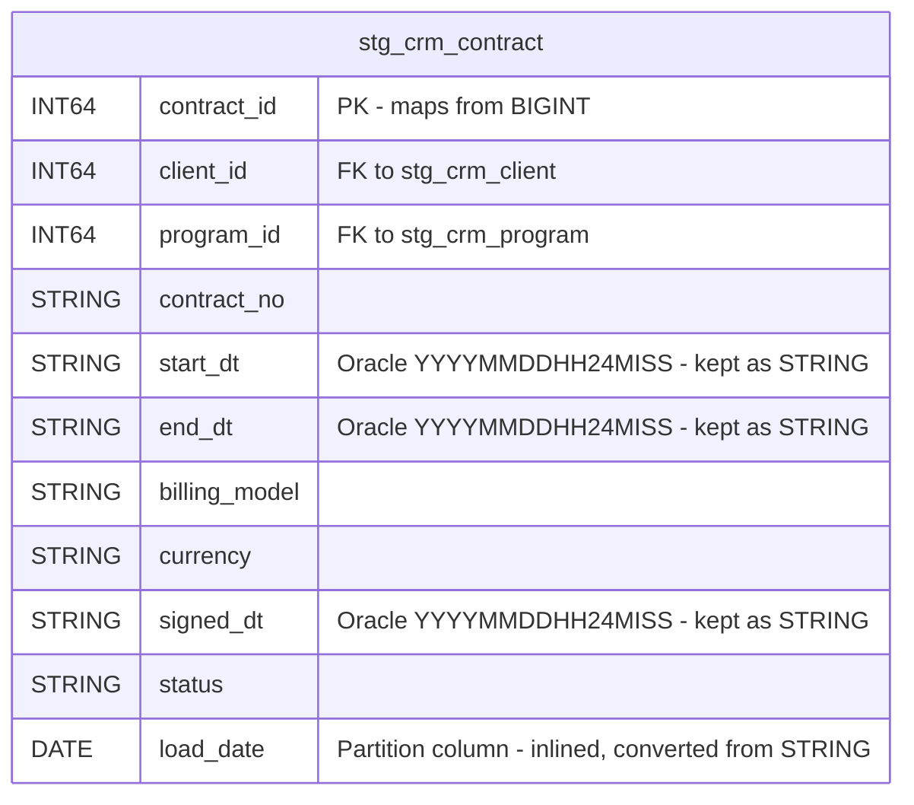

# Data Mapping

## Data Mapping: `staging.stg_crm_contract` (Hive → BigQuery)

### Source DDL (Hive/Impala)
```sql
CREATE EXTERNAL TABLE IF NOT EXISTS staging.stg_crm_contract (
  contract_id    BIGINT,
  client_id      BIGINT,
  program_id     BIGINT,
  contract_no    STRING,
  start_dt       STRING COMMENT 'Oracle string YYYYMMDDHH24MISS (legacy)',
  end_dt         STRING COMMENT 'Oracle string YYYYMMDDHH24MISS (legacy)',
  billing_model  STRING,
  currency       STRING,
  signed_dt      STRING COMMENT 'Oracle string YYYYMMDDHH24MISS (legacy)',
  status         STRING
)
PARTITIONED BY (load_date STRING)
STORED AS PARQUET
LOCATION 'hdfs://nbcs-cdh-ns/data/staging/stg_crm_contract'
TBLPROPERTIES ('parquet.compression'='SNAPPY');
```

### Target ER Diagram



### Column Mapping (Source → Target)

| # | Source Column | Source Type | Target Column | Target Type | Transformation | Notes |
|---|---|---|---|---|---|---|
| 1 | `contract_id` | BIGINT | `contract_id` | INT64 | Direct map | Hive BIGINT → BQ INT64 (identical range) |
| 2 | `client_id` | BIGINT | `client_id` | INT64 | Direct map | |
| 3 | `program_id` | BIGINT | `program_id` | INT64 | Direct map | |
| 4 | `contract_no` | STRING | `contract_no` | STRING | Direct map | |
| 5 | `start_dt` | STRING | `start_dt` | STRING | Direct map | Oracle `YYYYMMDDHH24MISS` preserved as STRING per AC#2 |
| 6 | `end_dt` | STRING | `end_dt` | STRING | Direct map | Oracle `YYYYMMDDHH24MISS` preserved as STRING per AC#2 |
| 7 | `billing_model` | STRING | `billing_model` | STRING | Direct map | |
| 8 | `currency` | STRING | `currency` | STRING | Direct map | |
| 9 | `signed_dt` | STRING | `signed_dt` | STRING | Direct map | Oracle `YYYYMMDDHH24MISS` preserved as STRING per AC#2 |
| 10 | `status` | STRING | `status` | STRING | Direct map | |
| 11 | `load_date` (partition col) | STRING | `load_date` | **DATE** | **Type change: STRING → DATE** | Inlined as regular column; used as partition key. Only type change in this table. |

### Dropped Clauses (Source → Target)

| Source Clause | Disposition |
|---|---|
| `EXTERNAL TABLE` | Dropped — BigQuery table is managed |
| `STORED AS PARQUET` | Dropped — BigQuery manages storage format |
| `LOCATION 'hdfs://...'` | Dropped — no HDFS |
| `TBLPROPERTIES ('parquet.compression'='SNAPPY')` | Dropped — BigQuery manages compression |

### Partition Strategy

| Aspect | Source (Hive) | Target (BigQuery) |
|---|---|---|
| Mechanism | `PARTITIONED BY (load_date STRING)` | `PARTITION BY load_date` (DATE column) |
| Column location | Declared separately after column list | Inlined in column list |
| Type | STRING | DATE |
| Granularity | Per distinct value | Daily (BigQuery DATE partitioning default) |

### No Tables Merged, Split, or Renamed
This is a 1:1 table conversion. The table name `stg_crm_contract` and all column names are preserved exactly. No columns are added, dropped, or renamed beyond the `load_date` type change.
